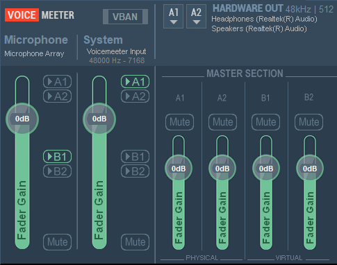

# VoiceMeeter DeskBand

## Motivation

More convenient simple sound management:

- Volume adjustment
- Active output switch (speakers/headphones/remote device/communication channel)
- Remote device support

Plenty of space always available in the taskbar

## Overview
Should provide deskband functionality for the following VoiceMeeter concept:

- Select hardware input and output
- Adjust hardware/virtual input/output fader gain
- Mute/unmute hardware/virtual input/output
- Configure hardware/virtual input routing
- Configure VBAN
- Enable/disable VBAN
- Restart audio engine
