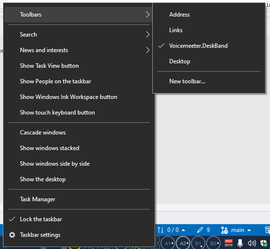

# Disclaimer

Voicemeeter is Audio Mixer Application endowed with Virtual Audio Device used as Virtual I/O to mix and manage any audio sources from or to any audio devices or applications.

Official website: https://voicemeeter.com/

Voicemeeter is a donationware, all participations are welcome.

# Voicemeeter DeskBand


## Motivation

More convenient simple sound management:


- Volume adjustment
- Active output switch (speakers/headphones/remote device/communication channel)
- Remote device support

Plenty of space always available in the taskbar

## Overview

### Limitations

- No Windows 11 support (yet)
- Voicemeeter Potato only (for now)
- Bugs (by using this software you are doing so at your own risk)

### Install

Build solution/download release, place Voicemeeter.DeskBand.dll into separate folder and run following command from elevated command prompt:

```
regsvr32 Voicemeeter.DeskBand.dll
```

Right click on taskbar empty space and check Toolbars->Voicemeeter.DeskBand



### Uninstall

Right click on taskbar empty space and uncheck Toolbars->Voicemeeter.DeskBand, run following command from elevated command prompt:

```
regsvr32 /u Voicemeeter.DeskBand.dll
```

(*Optional*) To release DLL file reboot or run following commands from elevated command prompt:

```
taskkill /IM "Explorer.exe" /F
Explorer.exe &
```

### Features

- Resizable (lock/unlock taskbar to adjust)
- Interactive (left click/right click/wheel/left hold and move)

# Support

If you like it you can support me with crypto:

