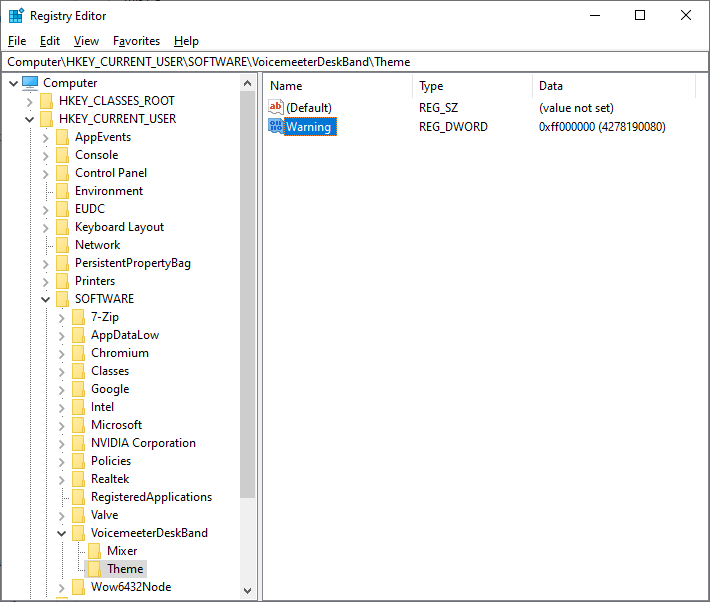
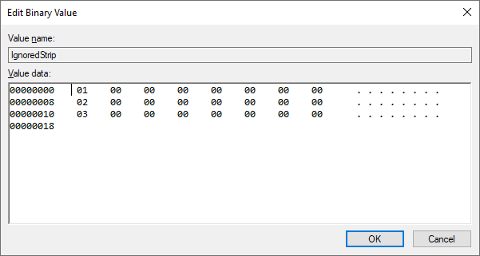

# Disclaimer

Voicemeeter is Audio Mixer Application endowed with Virtual Audio Device used as Virtual I/O to mix and manage any audio sources from or to any audio devices or applications

Official website: https://voicemeeter.com/

Voicemeeter is a donationware, all participations are welcome

# Voicemeeter DeskBand


## Motivation

More convenient simple sound management:


- Volume adjustment
- Active output switch (speakers/headphones/remote device/communication channel)
- Remote device support

Plenty of space always available in the taskbar

## Overview

### Limitations

- Bugs (by using this software you are doing so at your own risk)

### Install

#### Windows 10

Build solution/download release, place Voicemeeter.DeskBand.dll into separate folder and run following command from elevated command prompt:

```
regsvr32 Voicemeeter.DeskBand.dll
```

Right click on taskbar empty space and check Toolbars->Voicemeeter.DeskBand


Unlock taskbar, adjust deskband size and lock it back

#### Windows 11

Build solution/download release, run Voicemeeter.DeskBandit.exe

### Uninstall

#### Windows 10

Right click on taskbar empty space and uncheck Toolbars->Voicemeeter.DeskBand, run following command from elevated command prompt:

```
regsvr32 /u Voicemeeter.DeskBand.dll
```

(*Optional*) To release DLL file reboot or run following commands from elevated command prompt:

```
taskkill /IM "Explorer.exe" /F
Explorer.exe &
```

### Features

- Windows 10: Resizable (lock/unlock taskbar to adjust)
- Windows 11: Scalable
- Interactive (left click/middle click/right click/wheel/left hold and move)
- Customizable

### Customization

By default UI is animated with target 100 FPS

In case if you experience any issues or seek performance boost/power safety you can disable animations via registry key:

```
HKEY_CURRENT_USER\SOFTWARE\VoicemeeterDeskBand
```

Add DWORD value Animations and set it to 0


Custom colors and font family could be set via registry key:

```
HKEY_CURRENT_USER\SOFTWARE\VoicemeeterDeskBand\Theme
```

Value names could be taken from [Theme](src/Voicemeeter.UI.Cherry/Graphics/Palette.h)

Color type is DWORD in hexadecimal format RRGGBBAA (alpha channel is ignored)

For example, to change strip mute warning color to red use following value:



Controls could be disabled via registry key:

```
HKEY_CURRENT_USER\SOFTWARE\VoicemeeterDeskBand\Mixer
```

Add DWORD value Network and set it to 0 to disable VBAN button

Add REG_BINARY value IgnoredStrip and add 8 byte hex ID per each strip you wish to disable:

P = 0, V = 1, A1 = 2, A2 = 3, B1 = 4, B2 = 5

For example, to disable virtual input and both virtual output strips use following value:



> [!CAUTION]
> For any input strip to allign properly leave 0, 2 or 4 output strips

#### Windows 11

Docking position could be changed via registry key:

```
HKEY_CURRENT_USER\SOFTWARE\VoicemeeterDeskBand
```

Add DWORD value Dock and set it either to 0 or to 3:

Left = 0, Right = 3